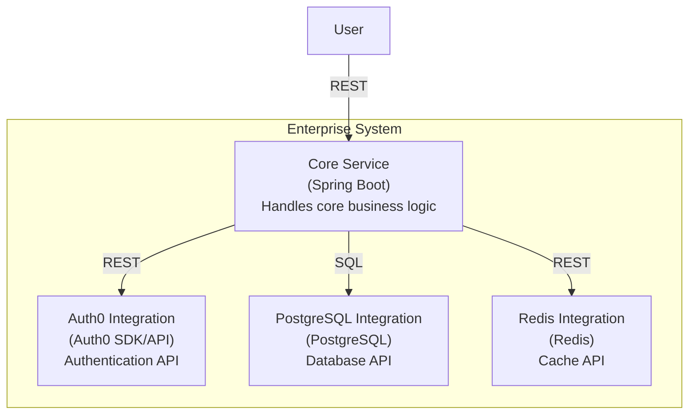
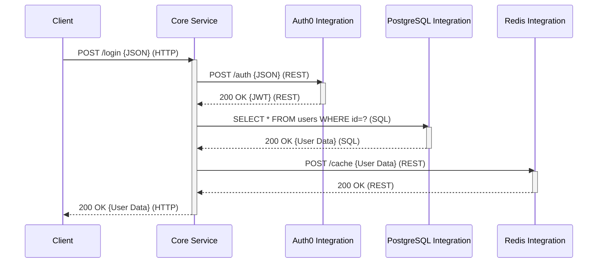
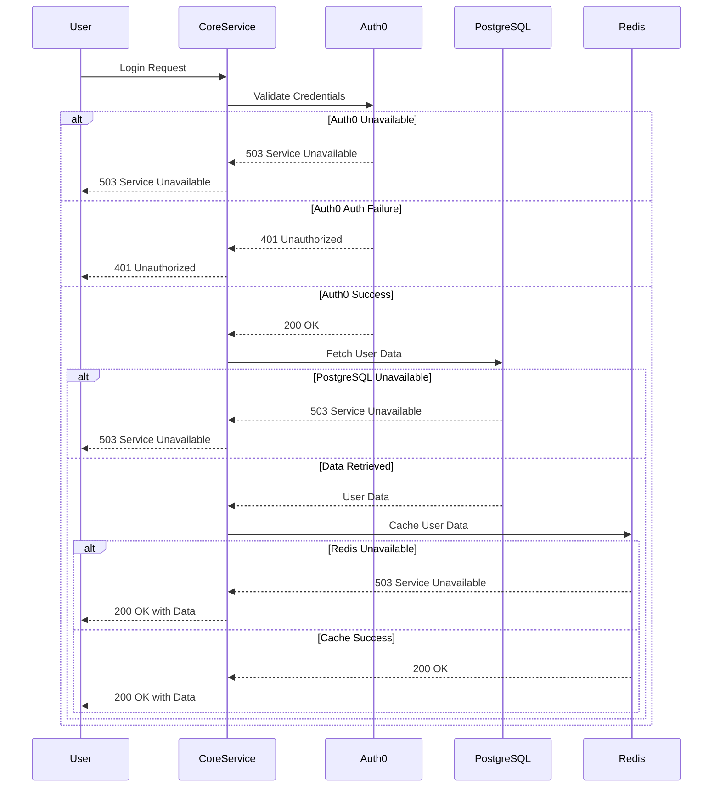
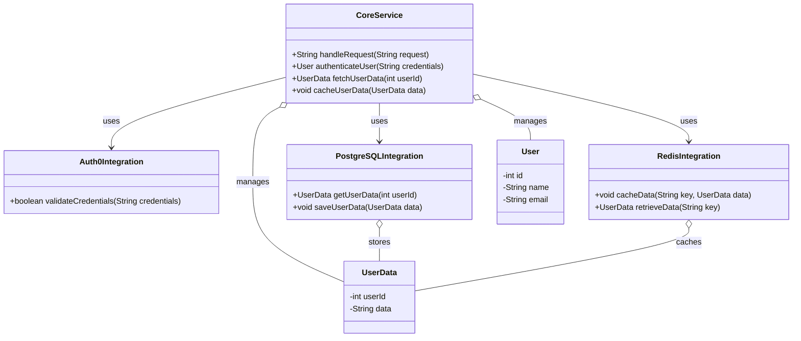
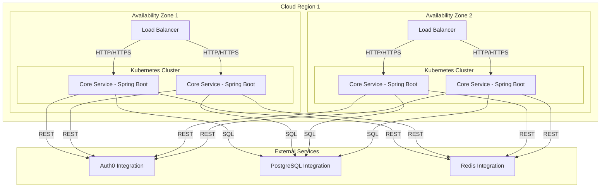

# Architecture Specification

**Document status:** DRAFT — pending resolution of open questions (Section 2)
**Prepared:** 2026-07-19
**Source input:** Architecture Analysis Report (auto-generated), Architecture Report, ADL specification, Weakness/FMEA analysis, Cross-cutting pattern catalog, Sourcing Decisions
**Domain / System Type:** Unknown (not supplied in source input — see Section 2)

---

## 1. Purpose and Scope

This specification formalizes the architecture decisions, components, quality attributes, and governance rules produced by the upstream analysis for a service-based system built around a Spring Boot **Core Service** integrated with **Auth0** (authentication), **PostgreSQL** (persistence), and **Redis** (caching).

This document is a synthesis, not a re-derivation. Where the source material was internally inconsistent, incomplete, or appeared to contain generic/templated content not specific to this system, that is flagged explicitly rather than silently resolved — per the instruction not to invent facts. See Section 2 and Section 13.

---

## 2. Open Questions and Data Quality Notes

### 2.1 Unresolved requirements (blocking a final spec)

The source analysis explicitly could not determine the domain or system type, and raised eight clarifying questions that remain unanswered. These should be resolved before this document is treated as final:

| # | Question | What it blocks |
|---|---|---|
| 1 | What is the primary system type (web app, microservices platform, etc.)? | Architectural style and technology stack selection |
| 2 | What are the specific functional requirements the architecture must support? | Verifying the architecture actually supports required use cases |
| 3 | What are the budget constraints? | Choosing between cost-efficient vs. feature-rich options |
| 4 | How is "consistent" defined in this context (tech stack vs. design principles)? | Resolving the ambiguity noted in Section 2.2 |
| 5 | What are the scalability requirements (target RPS, growth curve)? | Database and architecture style selection |
| 6 | Are there existing tools/technologies that must be integrated? | Compatibility and integration strategy |
| 7 | Is there a preference for open-source over vendor lock-in? | Build/buy/adopt sourcing decisions |
| 8 | What are the expected load conditions? | Database and architecture sizing |

**Recommendation:** Treat every design decision in this document as provisional until Q1, Q2, and Q5 are answered — they have the largest blast radius on architecture style and data-tier design.

### 2.2 Ambiguous terms carried forward without resolution

- **"Modular monolith" vs. "service-based"** — the source constraint set asked the architecture to be simultaneously consistent with both styles, which is not achievable as stated (a system is one or the other, though a modular monolith can be *migrated toward* service-based). The style-selection step resolved this by scoring and selecting service-based outright; the modular monolith remains the documented runner-up (Section 4).
- **"Spring Boot and Node.js" constraint** — the source constraints require consistency between two different backend runtimes at once. No component in the resulting design uses Node.js; only Spring Boot appears (Core Service). This constraint was effectively dropped rather than resolved. If Node.js is a hard requirement (e.g., for a separate BFF or edge layer), that scope was never designed and needs to be raised as a new requirement.
- **"Consistent"** as a quality signal was interpreted as data/transactional consistency (ACID) in the Quality Characteristics table, but the original constraint text ("architecture must be consistent between X and Y") reads more like *uniformity of approach*. These are different concerns; only the ACID interpretation was carried into the design.

### 2.3 Inconsistencies found in the source material

- **Sourcing Decisions lists services that do not exist in the Component design.** The design in Section 5 has exactly four components: Auth0 Integration, PostgreSQL Integration, Redis Integration, Core Service. The Sourcing Decisions table additionally scores build/buy/adopt for an *Order Service*, *Inventory Service*, *User Service*, *Search Platform*, *CDN Provider*, *Payment Provider*, *Email Delivery*, *SMS Delivery*, *Observability Platform*, and *Identity Provider* — none of which appear anywhere in the components, interactions, diagrams, or ADL rules. These read as generic e-commerce/SaaS template entries rather than decisions scoped to this system. **They are reproduced in Section 12 for completeness but should not be treated as approved scope** — they need to be either formally added to the component design or removed as noise.
- **Cross-cutting pattern catalog references components that don't exist in this system** (e.g., "AI processing service," "journal entries," "API Gateway," "notification service," "User Service and Order Service handling 5000 RPS," "local devices" syncing to a server). This appears to be a generic resiliency/scalability pattern library, not findings specific to this architecture. Section 11 reproduces only the patterns that are plausibly applicable to the four real components; the rest are omitted as out-of-scope noise. Full traceability is preserved in Appendix C for audit purposes.
- **ADL-004 contradicts the component design.** ADL-004 asserts "Core Service has NO DEPENDENCY ON InternalServices," but the design explicitly has Core Service depend on Auth0 Integration, PostgreSQL Integration, and Redis Integration. The architecture review already flagged this (see Section 9.4) and recommends clarifying that "InternalServices" in ADL-004 means *other internal business-logic services*, not the external integration adapters. Until that scoping is written into the ADL rule text, ADL-004 is ambiguous and should not be enforced as-is.
- **The "Rules" section of the source ADL document contained 20 entries with no content** (`[undefined] undefined (undefined)`) — omitted here as empty.
- **Override flag:** the Characteristic Coverage section reports `Override Applied: True` with no override warning text or explanation of what was overridden. This is noted here for traceability but could not be resolved from the source material — flag for the report's author.

---

## 3. Requirements

### 3.1 Functional requirements

| ID | Requirement | Priority |
|---|---|---|
| FR-001 | Ensure the architecture output is consistent | MUST |

Only one functional requirement was supplied, and it describes a property of the *output* rather than of the *system being built*. No product-level functional requirements (user-facing capabilities) were provided. This is the single largest gap in the input — see Q2 in Section 2.1.

### 3.2 Constraints

| Constraint | Type |
|---|---|
| Architecture must be consistent between modular monolith and service-based approaches | Technical |
| Architecture must be consistent between Spring Boot and Node.js | Technical |

Both constraints are addressed only partially — see Section 2.2.

### 3.3 Quality attribute targets

| Characteristic | Measurable Target | Evidence Level | Primary Tension |
|---|---|---|---|
| Scalability | p99 < 200ms @ 5,000 RPS | Explicit | Cost Efficiency |
| Consistency | ACID compliance for all transactions | Explicit | Scalability |
| Cost Efficiency | Monthly infra cost < $3,000 (growth stage) | Explicit | Scalability, Resilience |
| Resilience | 99.99% uptime with automatic failover | Implicit | Cost Efficiency |
| Flexibility | Seamless deployment across VM and Kubernetes | Inferred | Consistency |
| Performance | Avg response time < 100ms under peak load | Explicit | Cost Efficiency |

Note the growth path implied elsewhere in the source (50 → 5,000 RPS, MVP → enterprise scale) is referenced narratively but never given as a discrete staged target (e.g., RPS at MVP vs. growth vs. enterprise). Only the enterprise-scale ceiling (5,000 RPS) and a mid-point warning threshold (400 RPS, Section 10) are numeric.

---

## 4. Architecture Style Decision

**Selected style:** Service-based
**Runner-up:** Modular monolith

| Style | Score | Driving Characteristics | Vetoed | Veto Reason |
|---|:---:|---|:---:|---|
| Service-based | 15 | Scalability, Flexibility | No | — |
| Modular monolith | 12 | Consistency, Cost Efficiency | No | — |
| Microservices | 9 | Scalability | **Yes** | Data integrity/consistency is primary |
| Layered | 8 | Simplicity, Cost Efficiency | No | — |
| Event-driven | 7 | Resilience | **Yes** | Data integrity/consistency is primary |
| Microkernel | 6 | Flexibility | No | — |
| Pipeline | 5 | Performance | No | — |
| Space-based | 4 | Elasticity | **Yes** | Cost or simplicity is primary |

**Rationale:** Service-based scored highest by balancing scalability and flexibility against the ACID consistency requirement. Microservices and event-driven were vetoed outright because strong consistency (ACID compliance is an explicit, non-negotiable target) is incompatible with their default consistency models without significant additional distributed-transaction machinery. Space-based was vetoed because cost efficiency and simplicity dominate at the current stage.

**Architecture review outcome:** This style selection was independently reviewed and **not challenged** — it was assessed as well-justified given the stated characteristics.

**Known limit of this decision (see W-003, Section 10):** the service-based style, as currently scoped around a single Core Service, is not expected to sustain 5,000 RPS. A load threshold of ~400 RPS is identified as the point to begin planning a transition toward microservices. This is a *deferred re-architecture*, not a flaw in the current decision — see TD-001 and the Trade-off Challenge on TD-001 in Section 9.3.

---

## 5. Component Architecture

| Component | Type | Technology | Responsibility | Driving Characteristics | Depends On |
|---|---|---|---|---|---|
| **Core Service** | Service | Spring Boot | Core business logic; owns its data store exclusively | Scalability, Consistency | Auth0 Integration, PostgreSQL Integration, Redis Integration |
| **Auth0 Integration** | External adapter | Auth0 SDK/API | Authentication | Security | — |
| **PostgreSQL Integration** | External adapter | PostgreSQL | Data persistence (sole persistence provider) | Consistency | — |
| **Redis Integration** | External adapter | Redis | Caching (sole caching provider) | Performance | — |

This is a single-service architecture with three externalized integration adapters, not a multi-service topology. "Service-based" here refers to Core Service being an independently deployable unit with isolated external dependencies, not to a decomposed set of internal business services. If the domain actually requires multiple internal services (e.g., the Order/Inventory/User services implied by the sourcing table — see Section 2.3), the component design needs to be extended before those enter scope.

### 5.1 Container diagram

### 5.2 Interactions

| From | To | Protocol | Purpose |
|---|---|---|---|
| Core Service | Auth0 Integration | REST (synchronous) | User authentication |
| Core Service | PostgreSQL Integration | SQL | CRUD / persistence, ACID compliance |
| Core Service | Redis Integration | REST | Cache frequently accessed data |

All three integrations are synchronous. This is a deliberate trade-off (immediate feedback to the caller) but is also the direct cause of W-001 and FMEA-005 (Section 10) — a slow or unavailable Auth0 can cascade into Core Service request failures with no isolation.

---

## 6. Behavior: Primary and Error Flows

### 6.1 Primary flow — user authentication and data retrieval

1. Core Service receives a login request.
2. Auth0 Integration authenticates the credentials.
3. Core Service fetches user data from PostgreSQL.
4. Redis Integration caches the user data for subsequent requests.

### 6.2 Error handling flow

Note the asymmetry that is worth calling out explicitly: a PostgreSQL outage fails the entire request (correct — data can't be served), but a Redis outage degrades gracefully to a 200 with uncached data. Auth0 unavailability currently fails hard with no fallback, which is the gap W-001 and FMEA-001/FMEA-005 target.

### 6.3 Domain model (illustrative)

This class diagram is illustrative of the authentication/caching flow only — it is not a full domain model, since no functional requirements beyond FR-001 were supplied to derive one from.

---

## 7. Deployment Architecture

Single region, two availability zones, four Core Service replicas behind per-AZ load balancers, single (unreplicated in this diagram) PostgreSQL and Redis endpoints. **Gap:** the diagram does not show PostgreSQL/Redis replication or failover topology, which is inconsistent with the 99.99% uptime target (W-002, FMEA-002) — the data tier as drawn is a single point of failure for the whole system regardless of how many Core Service replicas exist.

---

## 8. Architecture Decision Records

### ADR-001: Adopt service-based architecture over modular monolith
- **Status:** Accepted (see caveat below)
- **Optimizes:** Scalability, Flexibility
- **Sacrifices:** Cost Efficiency
- **Alternative rejected:** Modular monolith — simpler and cheaper, but insufficient scalability/flexibility for variable load and deployment targets
- **Confidence:** High
- **Context dependency:** If load stays consistently low and deployment environments don't vary, a modular monolith would be more cost-effective — revisit if those conditions hold.
- **Caveat from review:** flagged high-severity — this decision may not hold past ~400 RPS (W-003). **Recommendation from review:** plan the phased transition to microservices earlier rather than waiting for the limit to be hit in production.

### ADR-002: Use Redis for caching
- **Status:** Accepted
- **Optimizes:** Performance
- **Sacrifices:** Cost Efficiency
- **Alternative rejected:** No caching layer — would degrade response times under peak load
- **Confidence:** High
- **Context dependency:** Reconsider if performance requirements relax or budget tightens further.
- **Caveat from review (medium severity):** no robust fallback strategy is currently defined for Redis downtime. **Recommendation:** implement a documented fallback (see W-005 mitigation, Section 10).

### ADR-003: Integrate with Auth0 for authentication
- **Status:** Accepted
- **Optimizes:** Security
- **Sacrifices:** Flexibility
- **Alternative rejected:** Build custom auth — high development/maintenance cost, distracts from core business logic
- **Confidence:** Medium
- **Context dependency:** Reconsider only if a specific auth capability Auth0 cannot support becomes a requirement.
- **Caveat from review (medium severity):** vendor lock-in risk. **Recommendation:** document a contingency plan for migrating to an alternative provider (W-006 mitigation).

### ADR-004: Direct interaction with PostgreSQL (no ORM)
- **Status:** Accepted
- **Optimizes:** Consistency
- **Sacrifices:** Flexibility (and, implicitly, development velocity)
- **Alternative rejected:** ORM-mediated access — simplifies development but risks performance overhead and reduced control over SQL, which conflicts with the ACID target
- **Confidence:** High
- **Context dependency:** Reconsider if development speed becomes a higher priority than strict consistency control.

### ADR-005: Deploy on a small Kubernetes cluster during the growth stage
- **Status:** Accepted
- **Optimizes:** Scalability, Resilience
- **Sacrifices:** Cost Efficiency
- **Alternative rejected:** Single VM — insufficient scalability/resilience as load grows
- **Confidence:** Medium
- **Context dependency:** Reconsider if growth slows significantly; a simpler deployment model may become more cost-effective.
- **Caveat from review (medium severity):** Kubernetes may not be cost-efficient at growth-stage traffic levels, in tension with the <$3,000/month target. **Recommendation:** model the actual cost before committing, and have a simpler fallback deployment model ready.

---

## 9. Quality Attribute Tensions and Trade-offs

### 9.1 Identified conflicts

| Tension | Type | Resolution | Recommendation |
|---|---|---|---|
| Scalability vs. Cost Efficiency | Tension | Auto-scaling with cost monitoring | Favor scalability at peak; optimize cost off-peak |
| Consistency vs. Scalability | Direct conflict | Eventual consistency where possible; distributed/compensating transactions for critical paths | Prioritize consistency for critical data, especially during any future microservices transition |
| Cost Efficiency vs. Resilience | Tension | Tiered resilience — high availability only for critical components | Favor resilience for critical systems; accept lower availability elsewhere |
| Flexibility vs. Consistency | Risk amplifier | Robust CI/CD with automated testing across environments | Prioritize consistency; introduce flexibility incrementally |
| Performance vs. Cost Efficiency | Tension | Optimize code/queries before adding infrastructure spend | Favor performance at peak; optimize cost during normal load |

### 9.2 Assumption risks (from architecture review)

The review identified ten assumptions embedded in the design, each with a stated risk and mitigation. The ones with the most direct bearing on near-term decisions:

| Assumption | Risk if wrong | Recommended action |
|---|---|---|
| System won't exceed 400 RPS in the growth stage | Bottlenecks and degraded performance | Stress-test; be ready to start the microservices migration early |
| Spring Boot and Node.js integrate without significant overhead | Increased complexity/maintenance if wrong — *note: no Node.js component currently exists in the design, so this assumption may be moot; see Section 2.2* | Proof-of-concept before adding any Node.js component |
| Team has the skills to manage both Spring Boot and Node.js | Slower delivery, technical debt | Skills assessment; training or hiring as needed |
| Data consistency holds across style transitions | Application errors, poor UX | Test data consistency explicitly; consider distributed transaction tooling |
| Network reliability won't affect Auth0/Redis integration performance | Auth failures, slow retrieval | Design for network failure: retries, fallbacks, monitoring |
| Monthly infra cost stays in projected range | Budget strain | Regular cost review and optimization |
| Growth is linear as projected | Architecture may not handle unexpected load | Scalable-by-default practices; monitor growth trends |
| No multi-region deployment needed during growth | Can't add geo-redundancy efficiently later | Design for extensibility to multi-region |
| Monolith → service-based transition is smooth | Downtime, business disruption | Detailed migration plan with rollback strategy, tested in staging |
| Current architecture meets stated performance targets | User dissatisfaction, lost business | Continuous performance monitoring and optimization |

### 9.3 Trade-off challenges raised in review

| Decision | Concern | Suggested revision | Severity |
|---|---|---|---|
| ADR-001 | May not hold past 400 RPS | Plan phased microservices transition earlier | High |
| ADR-002 | No robust Redis fallback | Implement comprehensive fallback strategy | Medium |
| ADR-003 | Auth0 vendor lock-in | Contingency plan for alternate provider | Medium |
| ADR-005 | Kubernetes cost may exceed budget at growth stage | Evaluate cost; consider simpler deployment if growth slows | Medium |

### 9.4 Governance (ADL) issues raised in review

| Issue | ADL ID | Type | Recommendation |
|---|---|---|---|
| Cost Efficiency characteristic has no ADL governance at all | N/A | Missing coverage | Add ADL rules enforcing cost monitoring / resource optimization |
| Deployment constraint enforcement is "soft" | ADL-010 | Weak assertion | Strengthen to "hard"; add deployment-config tests |
| W-002 (PostgreSQL bottleneck, high severity) has no corresponding ADL guard | N/A | Missing enforcement | Add an ADL rule to monitor/manage DB load (sharding trigger, etc.) |
| ADL-004 contradicts the actual component design | ADL-004 | Contradiction | Clarify "InternalServices" scope in ADL-004 so it doesn't conflict with Core Service's approved external dependencies (see Section 2.3) |
| Core API access restriction may block future integrations | ADL-017 | Over-specification | Consider a controlled-expansion mechanism for authorized services |

**Governance score (as reported):** 96/100.

---

## 10. Risk Register

### 10.1 Architectural weaknesses

| ID | Weakness | Category | Component | Severity | Likelihood | Effort to fix | Mitigation |
|---|---|---|---|:---:|:---:|---|---|
| W-002 | PostgreSQL becomes a bottleneck under high read/write load | Scale limit | PostgreSQL Integration | 5/5 | 4/5 | Months | Sharding or migration to a more horizontally scalable store (e.g., Cassandra) |
| W-003 | Service-based architecture may not sustain 5,000 RPS | Redesign point | Overall architecture | 4/5 | 5/5 | Rewrite | Plan gradual transition to microservices |
| W-001 | Synchronous Auth0 call can cause cascading timeouts | Fragility | Core Service → Auth0 | 4/5 | 3/5 | Weeks | Circuit breaker + fallback for auth failures |
| W-004 | No advanced monitoring for real-time issue detection | Operational | Overall system | 3/5 | 4/5 | Weeks | Prometheus/Grafana (or equivalent) monitoring and alerting |
| W-005 | Redis downtime/data loss degrades performance | Fragility | Core Service → Redis | 3/5 | 3/5 | Days | Graceful cache-failure fallback |
| W-006 | Auth0 vendor dependency (pricing/terms/SLA risk) | Operational | Auth0 Integration | 3/5 | 2/5 | Weeks | Contingency plan for alternate provider |

### 10.2 FMEA (ranked by RPN)

| Failure Mode | Component | S | O | D | RPN | Recommended Action |
|---|---|:---:|:---:|:---:|:---:|---|
| Lack of advanced monitoring | Overall system | 8 | 4 | 7 | 224 | Implement comprehensive monitoring |
| Auth0 API unavailability | Auth0 Integration | 9 | 4 | 6 | 216 | Backup auth mechanism / retry logic |
| PostgreSQL query latency | PostgreSQL Integration | 8 | 5 | 5 | 200 | Sharding or more scalable data store |
| Core Service overload | Core Service | 9 | 5 | 4 | 180 | Plan transition to microservices |
| Redis cache miss (cascading DB load) | Redis Integration | 7 | 4 | 6 | 168 | More robust caching strategy with redundancy |
| Synchronous REST timeout (Auth0) | Core Service → Auth0 | 8 | 4 | 5 | 160 | Circuit breaker pattern |
| Core Service dependency failure | Core Service | 8 | 4 | 5 | 160 | Dependency health monitoring + fallback strategies |
| DB transaction rollback failure | Core Service → PostgreSQL | 9 | 3 | 5 | 135 | Enhanced transaction management (retries, alerts) |
| Vendor lock-in with Auth0 | Auth0 Integration | 7 | 3 | 6 | 126 | Contingency plan for alternate providers |

**Reading this table:** the top three items (monitoring gap, Auth0 unavailability, PostgreSQL latency) account for the highest risk exposure and have no architecture-level mitigation currently designed in — they should be the first implementation priorities, ahead of any feature work.

### 10.3 Early warning signals to instrument for

- Increased query execution time / high CPU & memory on the database server (→ W-002)
- Sustained load above 400 RPS, rising latency and error rates under peak (→ W-003)
- Increased authentication latency, rising 401 rates (→ W-001)
- Delayed incident response, inability to correlate logs/metrics (→ W-004)
- Rising cache miss rate, higher downstream DB query load (→ W-005)
- Changes in Auth0 pricing/terms, declining support responsiveness (→ W-006)

---

## 11. Applicable Cross-Cutting Patterns

The source pattern catalog is broader than this system (see Section 2.3). The entries below are the subset that map to the four real components; the full, unfiltered catalog — including entries referencing components outside this system's scope — is preserved in Appendix C for traceability.

| Quality Attribute | Pattern | Priority | Effort | Application to this system |
|---|---|---|---|---|
| Availability / Resilience | Active Redundancy | Critical | High | Multiple active Core Service instances (already reflected in the deployment diagram, Section 7) |
| Security | Authenticate Actors | Critical | Medium | Already satisfied via Auth0 Integration |
| Privacy | Authenticate Actors | Critical | Medium | Already satisfied via Auth0 Integration |
| Privacy | Encrypt Data | Critical | Medium | Applies to any PII persisted in PostgreSQL — encryption at rest/in transit should be an explicit requirement, not assumed |
| Scalability | Horizontal Scaling | Critical | Medium | Applies directly to Core Service (see Section 7 deployment) |
| Scalability | Data Partitioning | Recommended | High | Directly relevant to resolving W-002 (PostgreSQL bottleneck) |
| Scalability | Asynchronous Processing | Recommended | Medium | Only applicable if/when long-running work is identified — no such requirement currently exists (FR gap, Section 2.1) |
| Consistency | Transactions (ACID) | Critical | Medium | Already satisfied — PostgreSQL provides this |
| Consistency | Maintain Multiple Copies of Data | Critical | High | Not yet reflected in the deployment diagram (Section 7 gap — no PostgreSQL/Redis replication shown) |
| Data Integrity | Transactions | Critical | Medium | Already satisfied via PostgreSQL |
| Resilience | Active Redundancy | Recommended | High | Applies to Redis and PostgreSQL tiers, which currently show no redundancy (Section 7 gap) |
| Cost Efficiency | Increase Resource Efficiency | Recommended | Medium | Applies to Core Service resource tuning under the Kubernetes deployment |
| User Trust | Inform Actors | Recommended | Low | Applicable to outage/incident notification — no notification mechanism currently exists in scope |
| Performance | Introduce Concurrency | Recommended | Medium | Generic; no specific bottleneck in this system currently points to this pattern |

**Already addressed per source annotation:** PostgreSQL's ACID compliance covers the Consistency/Transactions pattern requirement.

---

## 12. Sourcing Decisions (Build / Buy / Adopt)

**Scope caveat:** per Section 2.3, several rows below correspond to components not present in this system's design. They are reproduced for completeness and should be confirmed or removed before being treated as approved procurement decisions.

### 12.1 In scope (map directly to designed components)

| Item | Decision | Solution | Est. Cost | Lock-in Risk | Integration Effort |
|---|:---:|---|---|:---:|:---:|
| Auth0 Integration | Buy | Auth0 SDK/API | N/A | Medium | Low |
| PostgreSQL Integration | Buy/Adopt* | PostgreSQL | $0/mo (open-source) | Low | Low–Medium |
| Redis Integration | Buy/Adopt* | Redis | $0/mo (open-source) | Low | Low–Medium |
| Core Service | Build | Spring Boot | TBD | Low | Medium |
| (Identity provider, if Auth0 alternative needed) | Adopt | Keycloak | $0/mo | Low | Medium |

\* *The source data labels the Database and Cache as both "BUY" (component-derived entry) and "ADOPT" (dedicated entry) — inconsistent within the same source report. Adopt is the more accurate characterization for an open-source, self-hosted PostgreSQL/Redis, and is the recommended reading.*

### 12.2 Out of scope for this design — not present in the component architecture (Section 5)

| Item | Decision | Solution | Est. Cost | Note |
|---|:---:|---|---|---|
| User Service | Buy | Auth0 | $5,000–10,000/mo | Overlaps/duplicates the Auth0 Integration already in scope — likely a duplicate entry rather than a separate service |
| Order Service | Build | — | 6–12 months dev | No corresponding requirement or component exists |
| Inventory Service | Build | — | 4–8 months dev | No corresponding requirement or component exists |
| Email Delivery | Buy | SendGrid | $0/mo | No notification requirement currently in scope |
| SMS Delivery | Buy | Twilio | $0/mo | No notification requirement currently in scope |
| Observability Platform | Buy | Datadog | $180/mo | Plausibly relevant given W-004/FMEA-007 (monitoring gap) — worth formally adding to scope |
| Payment Provider | Buy | Stripe | $0/mo | No payment requirement currently in scope |
| Search Platform | Adopt | Elasticsearch | $0/mo | No search requirement currently in scope |
| CDN Provider | Buy | Cloudflare | $0/mo | No content-delivery requirement currently in scope |

**Recommendation:** the Observability Platform entry (Datadog, $180/mo) directly addresses the highest-RPN risk in this report (FMEA "lack of advanced monitoring," RPN 224) and should be formally pulled into scope. The remaining out-of-scope items should be confirmed with the requester — if they're intended, the component design, ADL rules, and diagrams in Sections 5–7 all need to be extended to include them.

---

## 13. Summary of Recommendations

In priority order, based on the RPN ranking (Section 10.2) and the review's severity ratings (Section 9.3):

1. **Close the requirements gap first.** Resolve the eight open questions in Section 2.1 — in particular system type, functional requirements, and target load curve — before treating this document as anything other than a draft.
2. **Add monitoring/observability to formal scope.** Highest RPN (224) with no current architectural mitigation. Datadog is already priced out in Section 12.1 ($180/mo) if a buy decision is preferred; Prometheus/Grafana if adopt is preferred.
3. **Add a circuit breaker around the Auth0 call.** Addresses W-001 / FMEA-005 (RPN 160) and the cascading-failure gap in the error-handling flow (Section 6.2).
4. **Design PostgreSQL and Redis for redundancy.** The deployment diagram (Section 7) currently shows both as single points of failure, which directly contradicts the 99.99% uptime target.
5. **Instrument the 400 RPS early-warning threshold now**, even before hitting it, so the microservices transition (W-003, ADR-001 caveat) is planned rather than reactive.
6. **Resolve ADL-004's contradiction** with the actual component dependency graph before treating ADL enforcement as authoritative.
7. **Confirm or discard the out-of-scope sourcing items** (Section 12.2) — as written, the sourcing analysis implies a materially larger system than the four-component architecture actually designed.

---

## Appendix A: Architecture Definition Language (ADL) Rules

19 hard-enforcement rules, 1 soft-enforcement rule (ADL-010), all using ArchUnit (Java). Full rule bodies are omitted here for brevity; summarized by intent:

| ADL ID | Rule Intent | Characteristic | Enforcement |
|---|---|---|:---:|
| ADL-001 | No internal User Service impl — must delegate to Auth0 | Security | Hard |
| ADL-002 | No internal Database impl — must delegate to PostgreSQL | Consistency | Hard |
| ADL-003 | No internal Cache impl — must delegate to Redis | Performance | Hard |
| ADL-004 | Core Service has no dependency on other internal services *(contradicts design — see 2.3)* | Scalability | Hard |
| ADL-005 | Auth0 Integration cannot be bypassed | Security | Hard |
| ADL-006 | PostgreSQL Integration is the sole persistence provider | Consistency | Hard |
| ADL-007 | Redis Integration is the sole caching provider | Performance | Hard |
| ADL-008 | Core Service exclusively owns its data store | Consistency | Hard |
| ADL-009 | No banned libraries in the codebase | Security | Hard |
| ADL-010 | Deployment constraints (e.g., Kubernetes) adhered to | Resilience | **Soft** |
| ADL-011 | Core Service does not leak internal logic to external integrations | Scalability | Hard |
| ADL-012 | No internal reimplementation of Auth0 functionality | Security | Hard |
| ADL-013 | No internal reimplementation of PostgreSQL functionality | Consistency | Hard |
| ADL-014 | No internal reimplementation of Redis functionality | Performance | Hard |
| ADL-015 | Core Service is the sole owner of core business logic | Scalability | Hard |
| ADL-016 | External services cannot access the data store directly | Consistency | Hard |
| ADL-017 | Only authorized services can access the Core API | Security | Hard |
| ADL-018 | Only Core Service can modify its own data | Consistency | Hard |
| ADL-019 | Only authorized services can access the Redis cache | Performance | Hard |
| ADL-020 | Only authorized services can access the PostgreSQL database | Consistency | Hard |

Governance score: **96/100** (per source report; scoring methodology not included in source material).

## Appendix B: Full Sourcing Table (unfiltered, 16 entries)

Reproduced verbatim from source for audit purposes — see Section 12 for the scope-filtered, annotated version.

| Item | Decision | Solution | Est. Cost | Lock-in | Integration Effort |
|---|:---:|---|---|:---:|:---:|
| Email Delivery | Buy | SendGrid | $0/mo | Medium | Low |
| SMS Delivery | Buy | Twilio | $0/mo | Medium | Low |
| Identity Provider | Adopt | Keycloak | $0/mo | Low | Medium |
| Observability Platform | Buy | Datadog | $180/mo | Medium | Medium |
| Payment Provider | Buy | Stripe | $0/mo | Medium | Medium |
| Search Platform | Adopt | Elasticsearch | $0/mo | Low | Medium |
| CDN Provider | Buy | Cloudflare | $0/mo | Medium | Low |
| User Service | Buy | Auth0 | $5,000–10,000/mo | Medium | Medium |
| Order Service | Build | — | 6–12 months dev | Low | High |
| Inventory Service | Build | — | 4–8 months dev | Low | High |
| Database | Adopt | PostgreSQL | $0/mo | Low | Medium |
| Cache | Adopt | Redis | $0/mo | Low | Medium |
| Auth0 Integration | Buy | Auth0 SDK/API | N/A | Medium | Low |
| PostgreSQL Integration | Buy | PostgreSQL | N/A | Medium | Low |
| Redis Integration | Buy | Redis | N/A | Medium | Low |
| Core Service | Build | Spring Boot | TBD | Low | Medium |

## Appendix C: Full Cross-Cutting Pattern Catalog (unfiltered)

Reproduced verbatim from source for audit purposes — includes entries referencing components outside this system (AI processing pipeline, journal entries, Order/Inventory/User Service, API Gateway, local device sync). See Section 11 for the scope-filtered version.

| Quality Attribute | Pattern | Priority | Effort | Application (as stated in source) |
|---|---|---|---|---|
| Recoverability | Active Redundancy | Critical | High | Deploy multiple active instances of the AI processing service |
| Recoverability | Rollback | Recommended | Medium | Rollback mechanisms for the data management system |
| Availability | Active Redundancy | Critical | High | Active redundancy in the API Gateway for 99.9% uptime |
| Security | Authenticate Actors | Critical | Medium | OAuth2 in the Authentication Service |
| Privacy | Authenticate Actors | Critical | Medium | User authentication in the AI processing pipeline |
| Privacy | Encrypt Data | Critical | Medium | Encrypt journal entries in the Data Storage Service |
| Scalability | Horizontal Scaling | Critical | Medium | Additional instances of the Core Domain Service, up to 1,000 users |
| Scalability | Horizontal Scaling | Critical | Medium | Scale User Service and Order Service to 5,000 RPS |
| Scalability | Asynchronous Processing | Recommended | Medium | Message queues for AI processing tasks |
| Scalability | Data Partitioning | Recommended | High | Partition the database for user and order data |
| Consistency | Maintain Multiple Copies of Data | Critical | High | Data replication between local devices and server |
| Consistency | Transactions | Critical | Medium | ACID transactions for order processing (already addressed by PostgreSQL) |
| Data Integrity | Transactions | Critical | Medium | Transactions in the Data Storage Service to prevent loss during sync |
| Data Integrity | Transactions | Critical | Medium | Transactions in the data management layer for offline/online consistency |
| Resilience | Active Redundancy | Recommended | High | Redundant Inventory Service instances for failover |
| Cost Efficiency | Increase Resource Efficiency | Recommended | Medium | Optimize Order Service async task handling |
| User Trust | Inform Actors | Recommended | Low | Notify users of outages within 30 minutes via notification service |
| Performance | Introduce Concurrency | Recommended | Medium | Concurrency in data synchronization service to reduce local save latency |
